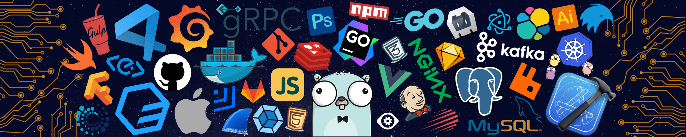

<!-- my-icons -->

    
    
    
    
    
    

<!-- my-header-img -->

&descAlign=79&fontAlign=50&descAlignY=70&fontColor=f7f5f5)

I'm a Software Engineer from <strong><a href="https://www.google.com/travel/things-to-do?dest_src=ut&dest_mid=%2Fm%2F05q7q">Paris</a></strong>, often in Bordeaux. Building my dev agency after 2 years of freelancing!

  
Currently working on

  
Building innovative projects with Next.js, TypeScript, React, Prisma, and PostgreSQL.

<h3>Quick Links</h3>

    
    

 

<ul>
    <li>💻 Freelance Software Engineer and <a href="https://42.fr/en/homepage/">42 School</a> Alumni</li>
    <li>🔭 I'm currently building my dev agency with a focus on <a href="https://nextjs.org/">Next.js</a> and <a href="https://www.typescriptlang.org/">TypeScript</a></li>
    <li>👨‍💻 Open to collaborating on innovative projects</li>
</ul>
<h2 id="lang">Skills</h2>

**Languages**

**Frameworks & Libraries**

**Databases**

**Tools**

**Blockchain**

### Socials  

   <

  

<h2>Quote of the day</h2>

    
See quote

    

<h2>☕️ Support My Work</h2>

    

